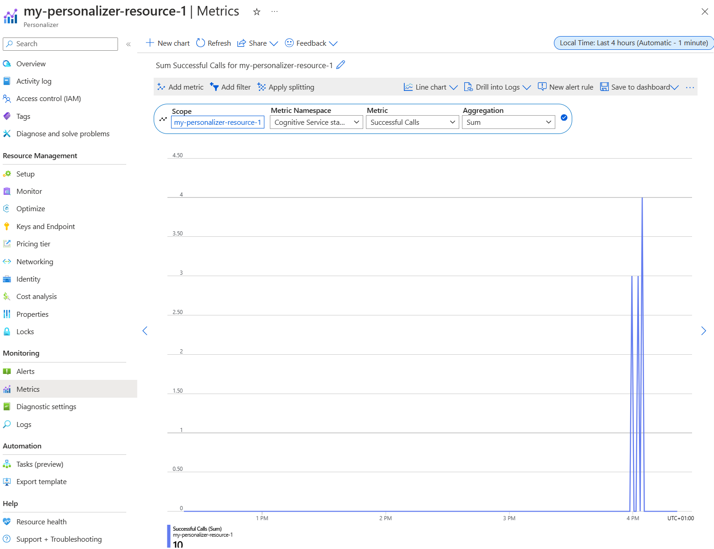

---
lab:
  title: Visual Studio Code Notebooks와 함께 AI Personalizer를 사용하여 루프 시뮬레이션
---
> **중요** 2023년 가을부터 새로운 Personalizer 리소스를 더 이상 만들 수 없습니다. 기존 Personalizer 리소스가 있는 경우 참조용으로만 이 리포지토리를 사용합니다.

이 연습에서는 Visual Studio Code의 Notebooks와 함께 Azure AI Personalizer를 사용하여 학습 루프를 시뮬레이션합니다.

## Azure Portal을 사용하여 Azure AI Personalizer 리소스 만들기

1. Azure Portal에서 **Azure AI 서비스**를 검색합니다. 그런 다음 결과 목록의 **Personalizer**에서 **만들기**를 선택합니다.

   

1. 구독을 선택하고 리소스 그룹 이름과 리소스 이름을 입력합니다. 가격 책정 계층으로 **무료 F0**을 선택합니다.
1. **검토 + 만들기**를 선택하여 선택한 내용을 검토한 다음 **만들기**를 선택하여 리소스를 만듭니다.
1. 새로 만들어진 Azure AI Personalizer 리소스로 이동한 다음 키 및 엔드포인트 창에서 나중에 사용할 수 있도록 **키** 및 **엔드포인트**를 복사하여 안전한 곳에 붙여넣습니다.

   

1. 탐색 창에서 설정을 선택한 다음 **보상 대기 시간**을 **10분**으로 설정하고(아직 설정하지 않은 경우) **모델 업데이트 빈도**를 **15초**로 설정합니다.
1. **저장**을 선택합니다.

## Notebook 설정

1. Visual Studio Code 편집기에서 **Ctrl+Shift+P**를 누르고 **만들기: 새로운 Jupyter Notebook**을 선택합니다.
1. 파일을 저장하고 디바이스에 이름을 **my-notebook**으로 지정합니다.
1. 이제 필요한 확장을 설치해야 합니다. Notebook 오른쪽 상단에서 **커널 선택**을 선택합니다. 그런 다음 **제안된 확장 설치/사용**을 선택합니다.

   

   > [!NOTE]
   > 이전에 이미 이 작업을 수행한 경우 이 옵션이 표시되지 않으며 이 단계를 건너뛸 수 있습니다.

1. 확장이 설치될 때까지 기다린 다음 나타나는 드롭다운에서 **Python 환경...** 을 선택합니다.
1. 그런 다음 가장 권장되는 환경을 선택합니다.

## 데이터 준비

이 연습의 목적을 위해 Azure AI Personalizer의 기본 데이터로 사용할 수 있는 사용자 목록과 커피 제품 목록을 만듭니다.

1. 다음 JSON 코드를 빈 파일에 복사하고 해당 파일을 Notebook 파일과 동일한 폴더에 `users.json`으로 저장합니다.

   ```json
   {
     "Alice": {
       "Sunny": {
         "Morning": "Cold brew",
         "Afternoon": "Iced mocha",
         "Evening": "Cold brew"
       },
       "Rainy": {
         "Morning": "Latte",
         "Afternoon": "Cappucino",
         "Evening": "Latte"
       },
       "Snowy": {
         "Morning": "Cappucino",
         "Afternoon": "Cappucino",
         "Evening": "Cappucino"
       }
     },
     "Bob": {
       "Sunny": {
         "Morning": "Cappucino",
         "Afternoon": "Iced mocha",
         "Evening": "Cold brew"
       },
       "Rainy": {
         "Morning": "Latte",
         "Afternoon": "Latte",
         "Evening": "Latte"
       },
       "Snowy": {
         "Morning": "Iced mocha",
         "Afternoon": "Iced mocha",
         "Evening": "Iced mocha"
       }
     },
     "Cathy": {
       "Sunny": {
         "Morning": "Latte",
         "Afternoon": "Cold brew",
         "Evening": "Cappucino"
       },
       "Rainy": {
         "Morning": "Cappucino",
         "Afternoon": "Latte",
         "Evening": "Iced mocha"
       },
       "Snowy": {
         "Morning": "Cold brew",
         "Afternoon": "Iced mocha",
         "Evening": "Cappucino"
       }
     },
     "Dave": {
       "Sunny": {
         "Morning": "Iced mocha",
         "Afternoon": "Iced mocha",
         "Evening": "Iced mocha"
       },
       "Rainy": {
         "Morning": "Latte",
         "Afternoon": "Latte",
         "Evening": "Latte"
       },
       "Snowy": {
         "Morning": "Cappucino",
         "Afternoon": "Cappucino",
         "Evening": "Cappucino"
       }
     }
   }
   ```

1. 다음으로, 다음 코드를 복사하여 `coffee.json`이라는 파일에 저장합니다.

   ```json
   [
     {
       "id": "Cappucino",
       "features": [
         {
           "type": "hot",
           "origin": "kenya",
           "organic": "yes",
           "roast": "dark"
         }
       ]
     },
     {
       "id": "Cold brew",
       "features": [
         {
           "type": "cold",
           "origin": "brazil",
           "organic": "yes",
           "roast": "light"
         }
       ]
     },
     {
       "id": "Iced mocha",
       "features": [
         {
           "type": "cold",
           "origin": "ethiopia",
           "organic": "no",
           "roast": "light"
         }
       ]
     },
     {
       "id": "Latte",
       "features": [
         {
           "type": "hot",
           "origin": "brazil",
           "organic": "no",
           "roast": "dark"
         }
       ]
     }
   ]
   ```

1. 다음 코드를 복사하여 파일에 붙여넣고 `example-rankrequest.json`으로 저장합니다.

   ```json
   {
     "contextFeatures": [],
     "actions": [],
     "excludedActions": [],
     "eventId": "",
     "deferActivation": false
   }
   ```

## 엔드포인트 및 키 설정

1. Notebook 상단에 다음 코드를 추가하여 필수 모듈을 포함합니다.

   ```python
   import json
   import matplotlib.pyplot as plt
   import random
   import requests
   import time
   import uuid
   import datetime
   ```

1. 셀을 선택한 다음, 셀 왼쪽에 있는 실행 단추를 선택합니다.

   

   > [!NOTE]
   > 새 셀을 채울 때마다 실행 단추를 선택하도록 합니다. ipykernel 패키지를 설치하라는 메시지가 표시되면 **설치**를 선택합니다.

1. Notebook 상단에서 **+ 코드**를 선택하여 새 코드 셀을 만듭니다. 다음 코드를 추가합니다.

   ```python
   # Replace 'personalization_base_url' and 'resource_key' with your valid endpoint values.
   personalization_base_url = "<your-endpoint>"
   resource_key = "<your-resource-key>"
   ```

1. **personalization_base_url** 값을 복사한 엔드포인트로 바꾸고, **resource_key** 값을 키로 바꿉니다.

## 반복 추적

1. 다음으로, 나중에 사용할 반복 함수의 시작 및 종료 시간을 기록하는 데 도움이 되는 코드를 만듭니다. 새 셀에 다음 코드를 추가합니다.

   ```python
   # Print out current datetime
   def currentDateTime():
       currentDT = datetime.datetime.now()
       print (str(currentDT))

   # ititialize variable for model's last modified date
   modelLastModified = ""

   def get_last_updated(currentModifiedDate):

       print('-----checking model')

       # get model properties
       response = requests.get(personalization_model_properties_url, headers = headers, params = None)

       print(response)
       print(response.json())

       # get lastModifiedTime
       lastModifiedTime = json.dumps(response.json()["lastModifiedTime"])

       if (currentModifiedDate != lastModifiedTime):
           currentModifiedDate = lastModifiedTime
           print(f'-----model updated: {lastModifiedTime}')
   ```

1. 새 코드를 추가한 후에는 새 셀을 실행해야 합니다.

## 정책 및 서비스 구성 가져오기

1. 다음으로 정책 및 서비스 구성을 가져와 서비스 상태의 유효성을 검사해야 합니다. 이렇게 하려면 새 셀에 다음 코드를 추가합니다.

   ```python
   def get_service_settings():

       print('-----checking service settings')

       # get learning policy
       response = requests.get(personalization_model_policy_url, headers = headers, params = None)

       print(response)
       print(response.json())

       # get service settings
       response = requests.get(personalization_service_configuration_url, headers = headers, params = None)

       print(response)
       print(response.json())
   ```

1. 새 코드 셀을 실행해야 합니다.

코드는 서비스 API를 두 번 호출하는 함수로 구성됩니다. 함수가 호출되면 응답을 사용하여 서비스 값을 반환합니다.

## 통화용 URL 설정 및 JSON 파일 읽기

이제 다음 항목에 코드를 추가합니다.

- REST 호출에 사용되는 URL 빌드
- Personalizer 리소스 키를 사용하여 보안 헤더 설정
- 순위 이벤트 ID에 대한 임의 시드를 설정합니다.
- JSON 데이터 파일에서 읽기
- get_last_updated 메서드 호출 - 출력 예에서 학습 정책이 제거되었습니다.
- get_service_settings 메서드 호출

1. 이렇게 하려면 새 셀에 다음 코드를 추가하고 실행합니다.

   ```python
   # build URLs
   personalization_rank_url = personalization_base_url + "personalizer/v1.0/rank"
   personalization_reward_url = personalization_base_url + "personalizer/v1.0/events/" #add "{eventId}/reward"
   personalization_model_properties_url = personalization_base_url + "personalizer/v1.0/model/properties"
   personalization_model_policy_url = personalization_base_url + "personalizer/v1.0/configurations/policy"
   personalization_service_configuration_url = personalization_base_url + "personalizer/v1.0/configurations/service"

   headers = {'Ocp-Apim-Subscription-Key' : resource_key, 'Content-Type': 'application/json'}

   # context
   users = "users.json"

   # action features
   coffee = "coffee.json"

   # empty JSON for Rank request
   requestpath = "example-rankrequest.json"

   # initialize random
   random.seed(time.time())

   userpref = None
   rankactionsjsonobj = None
   actionfeaturesobj = None

   with open(users) as handle:
       userpref = json.loads(handle.read())

   with open(coffee) as handle:
       actionfeaturesobj = json.loads(handle.read())

   with open(requestpath) as handle:
       rankactionsjsonobj = json.loads(handle.read())

   get_last_updated(modelLastModified)
   get_service_settings()

   print(f'User count {len(userpref)}')
   print(f'Coffee count {len(actionfeaturesobj)}')
   ```

1. 호출은 다음과 유사한 응답을 반환해야 합니다.

   ```bash
   -----checking model
   <Response [200]>
   {'creationTime': '2023-09-22T14:58:45+00:00', 'lastModifiedTime': '2023-09-22T14:58:45+00:00'}
   -----model updated: "2023-09-22T14:58:45+00:00"
   -----checking service settings
   <Response [200]>
   {'name': '917554355a3347a1af3d2935d521426a', 'arguments': '--cb_explore_adf --epsilon 0.20000000298023224 --power_t 0 -l 0.001 --cb_type mtr -q ::'}
   <Response [200]>
   {'rewardWaitTime': 'PT10M', 'defaultReward': 0.0, 'rewardAggregation': 'earliest', 'explorationPercentage': 0.2, 'modelExportFrequency': 'PT15S', 'logRetentionDays': 90, 'lastConfigurationEditDate': '2021-01-01T00:00:00', 'learningMode': 'Online'}
   User count 4
   Coffee count 4
   ```

1. 성공적인 호출을 나타내려면 응답 코드가 `<Response [200]>`이어야 합니다. **rewardWaitTime**은 10분으로 표시되어야 하며 **modelExportFrequency**는 15초로 표시되어야 합니다.

## Azure Portal에서 차트 설정

코드가 API에 요청합니다. 요청에 대한 적절한 메트릭을 가져오려면 Azure Portal에서 메트릭 차트를 만들 수 있습니다.

1. Azure Portal에서 Azure AI Personalizer 리소스로 이동합니다.

1. 탐색 창의 모니터링에서 **통계**를 선택합니다.

   

1. **범위** 및 **메트릭** 네임스페이스가 이미 설정되어 있습니다. **성공한 호출 수** **메트릭**과 **합계** **집계**만 선택하면 됩니다.

1. 시간 필터를 지난 4시간으로 변경합니다.

## 고유한 이벤트 ID 만들기

다음으로, 각 순위 API 호출에 대한 고유 ID를 생성하는 코드를 추가합니다. 이 ID를 사용하여 요청에 대한 순위 및 보상 호출 정보를 식별합니다.

1. 이렇게 하려면 Notebook에 새 코드 셀을 만들고 다음을 추가합니다.

   ```python
   def add_event_id(rankjsonobj):
       eventid = uuid.uuid4().hex
       rankjsonobj["eventId"] = eventid
       return eventid
   ```

1. 새 코드 셀을 실행해야 합니다.

> [!NOTE]
> 실제 시나리오에서는 이를 구매에 대한 트랜잭션 ID와 같은 것으로 설정합니다.

## 사용자, 시간, 날씨 가져오기

이제 다음 항목에 함수를 추가할 수 있습니다.

- 고유 사용자, 시간, 날씨 조합을 선택합니다.
- 호출을 통해 순위 API로 전송될 JSON 개체에 선택한 항목을 추가합니다.

이렇게 하려면 새 셀에 다음 코드를 추가하고 실행합니다.

```python
def add_random_user_and_contextfeatures(namesoption, weatheropt, timeofdayopt, rankjsonobj):
    name = namesoption[random.randint(0,3)]
    weather = weatheropt[random.randint(0,2)]
    timeofday = timeofdayopt[random.randint(0,2)]
    rankjsonobj['contextFeatures'] = [{'timeofday': timeofday, 'weather': weather, 'name': name}]
    return [name, weather, timeofday]
```

## 커피 데이터 추가

다음으로 커피 제품의 전체 목록을 JSON 개체로 가져온 다음 순위 API로 보내는 함수를 만듭니다.

이렇게 하려면 새 셀에 다음 코드를 추가하고 실행합니다.

```python
def add_action_features(rankjsonobj):
    rankjsonobj["actions"] = actionfeaturesobj
```

## 알려진 사용자 기본 설정과 예측 비교

그런 다음 날씨, 시간 등의 세부 사항을 고려하여 특정 커피에 대한 사용자의 기본 설정을 Azure AI Personalizer가 제안하는 것과 비교하는 함수를 만들 수 있습니다.

1. 이렇게 하려면 새 셀을 만들고 다음 코드를 추가한 후 실행합니다.

   ```python
   def get_reward_from_simulated_data(name, weather, timeofday, prediction):
       if(userpref[name][weather][timeofday] == str(prediction)):
           return 1
       return 0
   ```

1. 이 함수는 순위 API가 호출될 때마다 실행되도록 만들어졌습니다. 제안 사항이 일치하면 응답에 `1` 점수가 반환됩니다. 일치하지 않으면 `0`이 반환됩니다.

## 순위 및 보상 API 호출로 루프 만들기

이전 셀은 루프용 Notebook을 설정하는 데 사용됩니다. 이제 루프를 구성합니다. 루프는 Notebook의 주요 작업을 다룹니다. 임의의 사용자를 확보하고 커피 목록을 가져온 다음 둘 다 순위 API로 보냅니다. Azure AI Personalizer의 예측을 해당 사용자의 알려진 성향과 비교한 다음 보상을 다시 Azure AI Personalizer로 보냅니다.

루프를 만들려면 다음 코드를 새 셀에 추가하고 실행합니다.

```python
def iterations(n, modelCheck, jsonFormat):

    i = 1

    # default reward value - assumes failed prediction
    reward = 0

    # Print out dateTime
    currentDateTime()

    # collect results to aggregate in graph
    total = 0
    rewards = []
    count = []

    # default list of user, weather, time of day
    namesopt = ['Alice', 'Bob', 'Cathy', 'Dave']
    weatheropt = ['Sunny', 'Rainy', 'Snowy']
    timeofdayopt = ['Morning', 'Afternoon', 'Evening']


    while(i <= n):

        # create unique id to associate with an event
        eventid = add_event_id(jsonFormat)

        # generate a random sample
        [name, weather, timeofday] = add_random_user_and_contextfeatures(namesopt, weatheropt, timeofdayopt, jsonFormat)

        # add action features to rank
        add_action_features(jsonFormat)

        # show JSON to send to Rank
        print('To: ', jsonFormat)

        # choose an action - get prediction from Personalizer
        response = requests.post(personalization_rank_url, headers = headers, params = None, json = jsonFormat)

        # show Rank prediction
        print ('From: ',response.json())

        # compare personalization service recommendation with the simulated data to generate a reward value
        prediction = json.dumps(response.json()["rewardActionId"]).replace('"','')
        reward = get_reward_from_simulated_data(name, weather, timeofday, prediction)*10

        # show result for iteration
        print(f'   {i} {currentDateTime()} {name} {weather} {timeofday} {prediction} {reward}')

        # send the reward to the service
        response = requests.post(personalization_reward_url + eventid + "/reward", headers = headers, params= None, json = { "value" : reward })

        # for every N rank requests, compute total correct  total
        total =  total + reward

        # every N iteration, get last updated model date and time
        if(i % modelCheck == 0):

            print("**** 10% of loop found")

            get_last_updated(modelLastModified)

        # aggregate so chart is easier to read
        if(i % 10 == 0):
            rewards.append( total)
            count.append(i)
            total = 0

        i = i + 1

    # Print out dateTime
    currentDateTime()

    return [count, rewards]
```

다음은 함수가 순위 API로 전송하는 JSON 구조의 예입니다.

```python
{
    'contextFeatures':[
      {
          'timeofday':'Evening',
          'weather':'Snowy',
          'name':'Alice'
      }
    ],
    'actions':[
      {
          'id':'Cappucino',
          'features':[
            {
                'type':'hot',
                'origin':'kenya',
                'organic':'yes',
                'roast':'dark'
            }
          ]
      }
        ...rest of the coffee list
    ],
    'excludedActions':[

    ],
    'eventId':'b5c4ef3e8c434f358382b04be8963f62',
    'deferActivation':False
}
```

순위 API는 다음과 같은 구조의 응답으로 응답합니다.

```python
{
    'ranking': [
        {'id': 'Latte', 'probability': 0.85 },
        {'id': 'Iced mocha', 'probability': 0.05 },
        {'id': 'Cappucino', 'probability': 0.05 },
        {'id': 'Cold brew', 'probability': 0.05 }
    ],
    'eventId': '5001bcfe3bb542a1a238e6d18d57f2d2',
    'rewardActionId': 'Latte'
}
```

각 루프 반복에는 임의로 선택된 사용자, 날씨, 시간 및 적절하게 결정된 보상이 표시됩니다.

```bash
1 Alice Rainy Morning Latte 1
```

`1` 보상이 표시되면 Azure AI Personalizer 리소스가 이 특정 사용자, 날씨 및 시간 조합에 대해 올바른 커피 형식을 선택한 것입니다.

## 루프를 실행하고 차트 결과 보기

Azure AI Personalizer에서는 모델을 만들려면 순위 API 및 보상 API를 수천 번 호출해야 합니다. 설정된 반복 횟수만큼 루프를 실행합니다.

1. 이렇게 하려면 새 코드 셀을 만들고 다음 코드를 추가한 후 실행합니다.

   ```python
   # max iterations
   num_requests = 150

   # check last mod date N% of time - currently 10%
   lastModCheck = int(num_requests * .10)

   jsonTemplate = rankactionsjsonobj

   # main iterations
   [count, rewards] = iterations(num_requests, lastModCheck, jsonTemplate)
   ```

1. Azure Portal에서 메트릭 차트를 자주 새로 고쳐 서비스에 대한 총 호출 수를 확인합니다.
1. 본 이벤트는 한동안 진행될 수 있습니다. 완료될 때까지 Notebook을 닫지 마세요. 루프가 약 20,000번의 호출(루프의 각 반복에 대한 순위 및 보상 호출)을 수행하면 루프가 종료됩니다.

1. 다음으로, 순위 이벤트 일괄 처리와 각 일괄 처리에 대해 만들어진 올바른 권장 사항 수를 표시하기 위해 Notebook에 차트를 만듭니다. 이렇게 하려면 새 셀에 다음 코드를 추가하고 실행합니다.

   ```python
   def createChart(x, y):
       plt.plot(x, y)
       plt.xlabel("Batch of rank events")
       plt.ylabel("Correct recommendations per batch")
       plt.show()

   createChart(count,rewards)
   ```

1. Notebook이 차트를 만듭니다.

   

> **팁:** 이상적으로 테스트가 완료되면 루프는 평균 100%에서 탐색 값을 뺀 비율(기본적으로 20%)로 올바른 권장 사항을 제공해야 하므로 여기서는 80%가 대상 비율입니다. 이를 달성하는 방법은 반복을 최소 10,000회 이상으로 늘리는 것입니다.

차트에는 기본 학습 정책을 기반으로 모델이 얼마나 성공적인지 표시됩니다. 이 차트는 학습 정책이 개선될 수 있음을 보여 줍니다. 평가를 실행한 후 정책을 변경하면 됩니다.

## 오프라인 평가 실행

> [!NOTE]
> 이 연습의 이 섹션은 Azure AI Personalizer 리소스를 50,000회 이상 호출한 후에만 수행할 수 있으므로 선택 사항입니다. 그러나 특정 시점에 리소스에 대해 50,000회 호출을 달성한 경우 이 섹션으로 돌아올 수 있습니다.

오프라인 평가를 실행하면 호출 수가 50,000회 이상인 Azure AI Personalizer 리소스에 대한 더 나은 학습 정책을 찾을 수 있습니다.

1. Azure Portal에서 Azure AI Personalizer 리소스의 최적화 창으로 이동하여 **평가 만들기**를 선택합니다.
1. 평가 이름을 제공하고 루프 평가의 시작 및 종료 날짜 범위를 선택합니다. 날짜 범위에는 평가에 중점을 두고 있는 날짜만 포함되어야 합니다.

   

1. 평가를 시작하려면 **평가 시작**을 선택합니다.

1. 평가가 완료되면 최적화 창의 평가 목록에서 선택합니다. 그리고 평균 보상, 신뢰 구간 등과 같은 세부 정보를 기반으로 학습 정책의 성능을 검토합니다.

   

1. 다음을 비롯한 몇 가지 정책이 표시됩니다.

   - **Online** - Azure AI Personalizer의 현재 정책
   - **Baseline1** - 앱의 기준 정책
   - **BaselineRand** - 임의로 작업을 수행하는 정책
   - **Inter-len#** 또는 **Hyper#** - 최적화 검색에서 만든 정책

1. 모델을 가장 잘 개선하는 정책에서 **적용**을 선택합니다.

## 리소스 정리

다른 학습 모듈을 위해 이 랩에서 만들어진 Azure 리소스를 사용하지 않는 경우 해당 리소스를 삭제하여 추가 요금이 발생하지 않도록 할 수 있습니다.

1. `https://portal.azure.com`에서 Azure Portal을 열고 상단 검색 창에서 이 랩에서 만든 리소스를 검색합니다.

2. 리소스 페이지에서 **삭제**를 선택하고 지침에 따라 리소스를 삭제합니다. 또는 전체 리소스 그룹을 삭제하여 모든 리소스를 동시에 정리할 수 있습니다.
